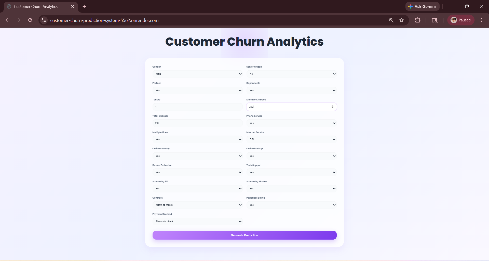
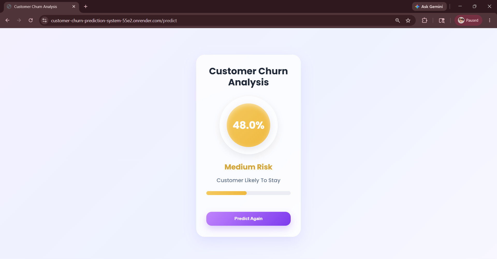
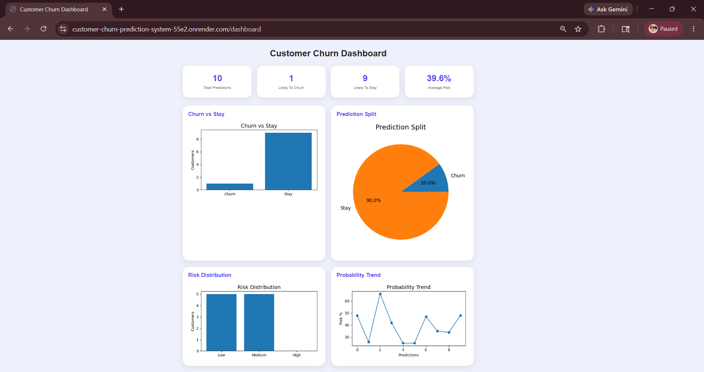
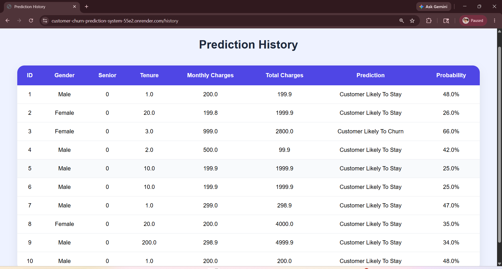

# Customer Churn Prediction System

## Project Preview

### Home Page


### Prediction Result


### Dashboard Analytics


### History Analytics



A machine learning web application that predicts telecom customer churn based on customer demographics, subscription details, and billing information.

The project combines model training, real-time prediction, database storage, analytics, and deployment into a complete end-to-end workflow.

---

## Live Demo

**Website:**  
(https://customer-churn-prediction-system-55e2.onrender.com/)

**GitHub Repository:**  
https://github.com/ayushii07/customer-churn-prediction-system

---

## Key Features

- Predicts customer churn using a trained Random Forest model
- Displays churn probability and risk level (Low / Medium / High)
- Real-time prediction through a Flask web interface
- Stores prediction history using SQLite database
- Dashboard with analytics and churn insights
- Fully deployed for public access

---

## Tech Stack

**Machine Learning:** Python, Scikit-learn, Random Forest, SMOTE  
**Backend:** Flask, SQLAlchemy, SQLite  
**Frontend:** HTML, CSS  
**Visualization:** Matplotlib  
**Deployment:** GitHub, Render

---

## Project Workflow

```text
Data Preprocessing → Label Encoding → Model Training
→ Flask Integration → Prediction System
→ Database Storage → Dashboard Analytics → Deployment
```

---

## Run Locally

```bash
git clone https://github.com/ayushii07/customer-churn-prediction-system.git
cd customer-churn-prediction-system
pip install -r requirements.txt
python app.py
```

---

## Future Improvements

- Model comparison for performance evaluation
- Explainable AI for prediction interpretation
- Enhanced analytics dashboard

---

## Author

**Ayushi**  
|Machine Learning Enthusiast | .